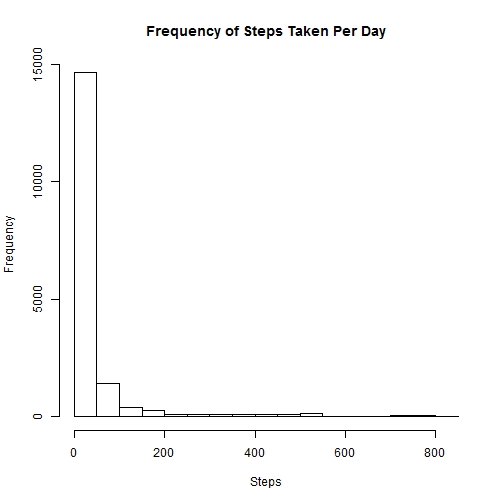

## Loading and preprocessing the data

```r
data = read.csv("activity.csv")
```


## What is mean total number of steps taken per day?


```r
hist(data$steps, main="Frequency of Steps Taken Per Day", xlab="Steps")
```

 

Mean steps taken per day is:


```r
mean(data$steps[!is.na(data$steps)])
```

```
## [1] 37.3826
```

Median of steps taken per day is:


```r
median(data$steps[!is.na(data$steps)])
```

```
## [1] 0
```

## What is the average daily activity pattern?


```r
aggregatedData = aggregate(steps ~ interval, data=data, mean)
plot(aggregatedData, type="l")
```

 

Which 5-minute interval, on average across all days, contains the maximum number of steps?


```r
aggregatedData$interval[which.max(aggregatedData$steps)]
```

```
## [1] 835
```

## Imputing missing values

How many rows in the dataset contain NAs?


```r
totalRows = nrow(data)
completeRows = sum(complete.cases(data))
totalRows - completeRows
```

```
## [1] 2304
```

Filling NA steps with mean for that 5-minute interval.


```r
dataWithNAFilled = data.frame(data)
matchingAggregateIndexes = match(data$interval[is.na(data$steps)], aggregatedData$interval)
dataWithNAFilled$steps[is.na(data$steps)] <- aggregatedData$steps[matchingAggregateIndexes]
```


```r
hist(dataWithNAFilled$steps, main="Frequency of Steps Taken Per Day", xlab="Steps")
```

 

Mean steps taken per day is:


```r
mean(dataWithNAFilled$steps)
```

```
## [1] 37.3826
```

Median of steps taken per day is:


```r
median(dataWithNAFilled$steps)
```

```
## [1] 0
```

The mean and median do not change from the initial estimates with missing data.

What is the impact of imputing missing data on the estimates of the total daily number of steps?

Mean Total Number of Daily Steps (including NAs):


```r
totalStepsPerDay1 = aggregate(steps ~ date, data=data, sum)
mean(totalStepsPerDay1$steps)
```

```
## [1] 10766.19
```

Mean Total Number of Daily Steps (filled NAs with mean per 5-minute inverval):


```r
totalStepsPerDay1 = aggregate(steps ~ date, data=dataWithNAFilled, sum)
mean(totalStepsPerDay1$steps)
```

```
## [1] 10766.19
```

Adding estimates of the missing data did not seem to change the mean of total steps per day.

## Are there differences in activity patterns between weekdays and weekends?

Adding a factor column, to distinguish weekdays from weekends.


```r
dataWithNAFilled$weekday <- factor(ifelse(weekdays(as.Date(dataWithNAFilled$date)) %in% c("Saturday", "Sunday"), "Weekend", "Weekday"))
```

Plotting average number of steps taken per 5-minute inverval, for Weekends versus Weekdays.


```r
weekendData = subset(dataWithNAFilled, weekday == "Weekend")
weekdayData = subset(dataWithNAFilled, weekday == "Weekday")
averageStepsTakenPerWeekendDay = aggregate(steps ~ interval, data=weekendData, mean)
averageStepsTakenPerWeekdayDay = aggregate(steps ~ interval, data=weekdayData, mean)

par(mfrow=c(2,1))
plot(averageStepsTakenPerWeekendDay, type="l", main="Weekends")
plot(averageStepsTakenPerWeekdayDay, type="l", main="Weekdays")
```

 
